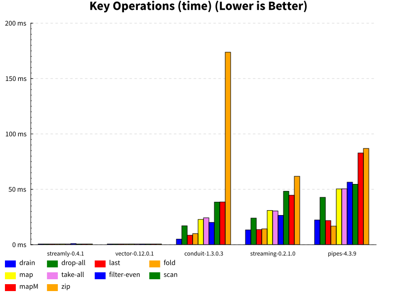

# Streamly

[](https://hackage.haskell.org/package/streamly)
[](https://gitter.im/composewell/streamly)
[](https://travis-ci.org/composewell/streamly)
[](https://ci.appveyor.com/project/harendra-kumar/streamly)
[](https://circleci.com/gh/composewell/streamly/tree/master)
[](https://coveralls.io/github/composewell/streamly?branch=master)


## Streaming Concurrently

Haskell lists express pure computations using composable stream operations like
`:`, `unfold`, `map`, `filter`, `zip` and `fold`.  Streamly is exactly like
lists except that it can express sequences of pure as well as monadic
computations aka streams. More importantly, it can express monadic sequences
with concurrent execution semantics without introducing any additional APIs.

Streamly expresses concurrency using standard, well known abstractions.
Concurrency semantics are defined for list operations, semigroup, applicative
and monadic compositions. Programmer does not need to know any low level
notions of concurrency like threads, locking or synchronization.  Concurrent
and non-concurrent programs are fundamentally the same.  A chosen segment of
the program can be made concurrent by annotating it with an appropriate
combinator.  We can choose a combinator for lookahead style or asynchronous
concurrency.  Concurrency is automatically scaled up or down based on the
demand from the consumer application, we can finally say goodbye to managing
thread pools and associated sizing issues.  The result is truly fearless
and declarative monadic concurrency.

## Where to use streamly?

Streamly is a general purpose programming framwework.  It can be used equally
efficiently from a simple `Hello World!` program to a massively concurrent
application. The answer to the question, "where to use streamly?" - would be
similar to the answer to - "Where to use Haskell lists or the IO monad?".
Streamly generalizes lists to monadic streams, and the `IO` monad to
non-deterministic and concurrent stream composition. The `IO` monad is a
special case of streamly; if we use single element streams the behavior of
streamly becomes identical to the IO monad.  The IO monad code can be replaced
with streamly by just prefixing the IO actions with `liftIO`, without any other
changes, and without any loss of performance.  Pure lists too are a special
case of streamly; if we use `Identity` as the underlying monad, streamly
streams turn into pure lists.  Non-concurrent programs are just a special case
of concurrent ones, simply adding a combinator turns a non-concurrent program
into a concurrent one.

In other words, streamly combines the functionality of lists and IO, with
builtin concurrency.  If you want to write a program that involves IO,
concurrent or not, then you can just use streamly as the base monad, in fact,
you could even use streamly for pure computations, as streamly performs at par
with pure lists or `vector`.

## Why data flow programming?

If you need some convincing for using streaming or data flow programming
paradigm itself then try to answer this question - why do we use lists in
Haskell? It boils down to why we use functional programming in the first place.
Haskell is successful in enforcing the functional data flow paradigm for pure
computations using lists, but not for monadic computations. In the absence of a
standard and easy to use data flow programming paradigm for monadic
computations, and the IO monad providing an escape hatch to an imperative
model, we just love to fall into the imperative trap, and start asking the same
fundamental question again - why do we have to use the streaming data model?

## Show me an example

Here is an IO monad code to list a directory recursively:

```haskell
import Control.Monad.IO.Class (liftIO)
import Path.IO (listDir, getCurrentDir) -- from path-io package

listDirRecursive = getCurrentDir >>= readdir
  where
    readdir dir = do
      (dirs, files) <- listDir dir
      liftIO $ mapM_ putStrLn
             $ map show dirs ++ map show files
      foldMap readdir dirs
```

This is your usual IO monad code, with no streamly specific code whatsoever.
This is how you can run this:

``` haskell
main :: IO ()
main = listDirRecursive
```

And, this is how you can run exactly the same code using streamly with
lookahead style concurrency, the only difference is that this time multiple
directories are read concurrently:

``` haskell
import Streamly (runStream, aheadly)

main :: IO ()
main = runStream $ aheadly $ listDirRecursive
```

Isn't that magical? What's going on here? Streamly does not introduce any new
abstractions, it just uses standard abstractions like `Semigroup` or
`Monoid` to combine monadic streams concurrently, the way lists combine a
sequence of pure values non-concurrently. The `foldMap` in the code
above turns into a concurrent monoidal composition of a stream of `readdir`
computations.

## How does it perform?

Providing monadic streaming and high level declarative concurrency does not
mean that `streamly` compromises with performance in any way. The
non-concurrent performance of `streamly` competes with lists and the `vector`
library. The concurrent performance is as good as it gets, see [concurrency
benchmarks](https://github.com/composewell/concurrency-benchmarks) for detailed
performance results and a comparison with the `async` package.

The following chart shows a summary of the cost of key streaming operations
processing a million elements. The timings for `streamly` and `vector` are in
the 600-700 microseconds range and therefore can barely be seen in the graph.
For more details, see [streaming
benchmarks](https://github.com/composewell/streaming-benchmarks).



## Streaming Pipelines

The following snippet provides a simple stream composition example that reads
numbers from stdin, prints the squares of even numbers and exits if an even
number more than 9 is entered.

``` haskell
import Streamly
import qualified Streamly.Prelude as S
import Data.Function ((&))

main = runStream $
       S.repeatM getLine
     & fmap read
     & S.filter even
     & S.takeWhile (<= 9)
     & fmap (\x -> x * x)
     & S.mapM print
```

Unlike `pipes` or `conduit` and like `vector` and `streaming`, `streamly`
composes stream data instead of stream processors (functions).  A stream is
just like a list and is explicitly passed around to functions that process the
stream.  Therefore, no special operator is needed to join stages in a streaming
pipeline, just the standard function application (`$`) or reverse function
application (`&`) operator is enough.  Combinators are provided in
`Streamly.Prelude` to transform or fold streams.

## Concurrent Stream Generation

Monadic construction and generation functions e.g. `consM`, `unfoldrM`,
`replicateM`, `repeatM`, `iterateM` and `fromFoldableM` etc. work concurrently
when used with appropriate stream type combinator (e.g. `asyncly`, `aheadly` or
`parallely`).

The following code finishes in 3 seconds (6 seconds when serial):

``` haskell
> let p n = threadDelay (n * 1000000) >> return n
> S.toList $ aheadly $ p 3 |: p 2 |: p 1 |: S.nil
[3,2,1]

> S.toList $ parallely $ p 3 |: p 2 |: p 1 |: S.nil
[1,2,3]
```

The following finishes in 10 seconds (100 seconds when serial):

``` haskell
runStream $ asyncly $ S.replicateM 10 $ p 10
```

## Concurrent Streaming Pipelines

Use `|&` or `|$` to apply stream processing functions concurrently. The
following example prints a "hello" every second; if you use `&` instead of
`|&` you will see that the delay doubles to 2 seconds instead because of serial
application.

``` haskell
main = runStream $
      S.repeatM (threadDelay 1000000 >> return "hello")
   |& S.mapM (\x -> threadDelay 1000000 >> putStrLn x)
```

## Mapping Concurrently

We can use `mapM` or `sequence` functions concurrently on a stream.

``` haskell
> let p n = threadDelay (n * 1000000) >> return n
> runStream $ aheadly $ S.mapM (\x -> p 1 >> print x) (serially $ repeatM (p 1))
```

## Serial and Concurrent Merging

Semigroup and Monoid instances can be used to fold streams serially or
concurrently. In the following example we compose ten actions in the
stream, each with a delay of 1 to 10 seconds, respectively. Since all the
actions are concurrent we see one output printed every second:

``` haskell
import Streamly
import qualified Streamly.Prelude as S
import Control.Concurrent (threadDelay)

main = S.toList $ parallely $ foldMap delay [1..10]
 where delay n = S.yieldM $ threadDelay (n * 1000000) >> print n
```

Streams can be combined together in many ways. We provide some examples
below, see the tutorial for more ways. We use the following `delay`
function in the examples to demonstrate the concurrency aspects:

``` haskell
import Streamly
import qualified Streamly.Prelude as S
import Control.Concurrent

delay n = S.yieldM $ do
    threadDelay (n * 1000000)
    tid <- myThreadId
    putStrLn (show tid ++ ": Delay " ++ show n)
```
### Serial

``` haskell
main = runStream $ delay 3 <> delay 2 <> delay 1
```
```
ThreadId 36: Delay 3
ThreadId 36: Delay 2
ThreadId 36: Delay 1
```

### Parallel

``` haskell
main = runStream . parallely $ delay 3 <> delay 2 <> delay 1
```
```
ThreadId 42: Delay 1
ThreadId 41: Delay 2
ThreadId 40: Delay 3
```

## Nested Loops (aka List Transformer)

The monad instance composes like a list monad.

``` haskell
import Streamly
import qualified Streamly.Prelude as S

loops = do
    x <- S.fromFoldable [1,2]
    y <- S.fromFoldable [3,4]
    S.yieldM $ putStrLn $ show (x, y)

main = runStream loops
```
```
(1,3)
(1,4)
(2,3)
(2,4)
```

## Concurrent Nested Loops

To run the above code with, lookahead style concurrency i.e. each iteration in
the loop can run run concurrently by but the results are presented in the same
order as serial execution:

``` haskell
main = runStream $ aheadly $ loops
```

To run it with depth first concurrency yielding results asynchronously in the
same order as they become available (deep async composition):

``` haskell
main = runStream $ asyncly $ loops
```

To run it with breadth first concurrency and yeilding results asynchronously
(wide async composition):

``` haskell
main = runStream $ wAsyncly $ loops
```

The above streams provide lazy/demand-driven concurrency which is automatically
scaled as per demand and is controlled/bounded so that it can be used on
infinite streams. The following combinator provides strict, unbounded
concurrency irrespective of demand:

``` haskell
main = runStream $ parallely $ loops
```

To run it serially but interleaving the outer and inner loop iterations
(breadth first serial):

``` haskell
main = runStream $ wSerially $ loops
```

## Magical Concurrency

Streams can perform semigroup (<>) and monadic bind (>>=) operations
concurrently using combinators like `asyncly`, `parallelly`. For example,
to concurrently generate squares of a stream of numbers and then concurrently
sum the square roots of all combinations of two streams:

``` haskell
import Streamly
import qualified Streamly.Prelude as S

main = do
    s <- S.sum $ asyncly $ do
        -- Each square is performed concurrently, (<>) is concurrent
        x2 <- foldMap (\x -> return $ x * x) [1..100]
        y2 <- foldMap (\y -> return $ y * y) [1..100]
        -- Each addition is performed concurrently, monadic bind is concurrent
        return $ sqrt (x2 + y2)
    print s
```

The concurrency facilities provided by streamly can be compared with
[OpenMP](https://en.wikipedia.org/wiki/OpenMP) and
[Cilk](https://en.wikipedia.org/wiki/Cilk) but with a more declarative
expression.

## Rate Limiting

For bounded concurrent streams, stream yield rate can be specified. For
example, to print hello once every second you can simply write this:

``` haskell
import Streamly
import Streamly.Prelude as S

main = runStream $ asyncly $ avgRate 1 $ S.repeatM $ putStrLn "hello"
```

For some practical uses of rate control, see
[AcidRain.hs](https://github.com/composewell/streamly/tree/master/examples/AcidRain.hs)
and
[CirclingSquare.hs](https://github.com/composewell/streamly/tree/master/examples/CirclingSquare.hs)
.
Concurrency of the stream is automatically controlled to match the specified
rate. Rate control works precisely even at throughputs as high as millions of
yields per second. For more sophisticated rate control see the haddock
documentation.

## Exceptions

From a library user point of view, there is nothing much to learn or talk about
exceptions.  Synchronous exceptions work just the way they are supposed to work
in any standard non-concurrent code. When concurrent streams are combined
together, exceptions from the constituent streams are propagated to the
consumer stream. When an exception occurs in any of the constituent streams
other concurrent streams are promptly terminated. Exceptions can be thrown
using the `MonadThrow` instance.

There is no notion of explicit threads in streamly, therefore, no
asynchronous exceptions to deal with. You can just ignore the zillions of
blogs, talks, caveats about async exceptions. Async exceptions just don't
exist.  Please don't use things like `myThreadId` and `throwTo` just for fun!


## Reactive Programming (FRP)

Streamly is a foundation for first class reactive programming as well by virtue
of integrating concurrency and streaming. See
[AcidRain.hs](https://github.com/composewell/streamly/tree/master/examples/AcidRain.hs)
for a console based FRP game example and
[CirclingSquare.hs](https://github.com/composewell/streamly/tree/master/examples/CirclingSquare.hs)
for an SDL based animation example.

## Conclusion

Streamly, short for streaming concurrently, provides monadic streams, with a
simple API, almost identical to standard lists, and an in-built
support for concurrency.  By using stream-style combinators on stream
composition, streams can be generated, merged, chained, mapped, zipped, and
consumed concurrently – providing a generalized high level programming
framework unifying streaming and concurrency. Controlled concurrency allows
even infinite streams to be evaluated concurrently.  Concurrency is auto scaled
based on feedback from the stream consumer.  The programmer does not have to be
aware of threads, locking or synchronization to write scalable concurrent
programs.

Streamly is a programmer first library, designed to be useful and friendly to
programmers for solving practical problems in a simple and concise manner. Some
key points in favor of streamly are:

  * _Simplicity_: Simple list like streaming API, if you know how to use lists
    then you know how to use streamly. This library is built with simplicity
    and ease of use as a design goal.
  * _Concurrency_: Simple, powerful, and scalable concurrency.  Concurrency is
    built-in, and not intrusive, concurrent programs are written exactly the
    same way as non-concurrent ones.
  * _Generality_: Unifies functionality provided by several disparate packages
    (streaming, concurrency, list transformer, logic programming, reactive
    programming) in a concise API.
  * _Performance_: Streamly is designed for high performance. It employs stream
    fusion optimizations for best possible performance. Serial peformance is
    equivalent to the venerable `vector` library in most cases and even better
    in some cases.  Concurrent performance is unbeatable.  See
    [streaming-benchmarks](https://github.com/composewell/streaming-benchmarks)
    for a comparison of popular streaming libraries on micro-benchmarks.

The basic streaming functionality of streamly is equivalent to that provided by
streaming libraries like
[vector](https://hackage.haskell.org/package/vector),
[streaming](https://hackage.haskell.org/package/streaming),
[pipes](https://hackage.haskell.org/package/pipes), and
[conduit](https://hackage.haskell.org/package/conduit).
In addition to providing streaming functionality, streamly subsumes
the functionality of list transformer libraries like `pipes` or
[list-t](https://hackage.haskell.org/package/list-t), and also the logic
programming library [logict](https://hackage.haskell.org/package/logict). On
the concurrency side, it subsumes the functionality of the
[async](https://hackage.haskell.org/package/async) package, and provides even
higher level concurrent composition. Because it supports
streaming with concurrency we can write FRP applications similar in concept to
[Yampa](https://hackage.haskell.org/package/Yampa) or
[reflex](https://hackage.haskell.org/package/reflex).

See the `Comparison with existing packages` section at the end of the
[tutorial](https://hackage.haskell.org/package/streamly/docs/Streamly-Tutorial.html).

## Further Reading

For more information, see:

  * [Detailed tutorial](https://hackage.haskell.org/package/streamly/docs/Streamly-Tutorial.html)
  * [Reference documentation](https://hackage.haskell.org/package/streamly)
  * [Examples](https://github.com/composewell/streamly/tree/master/examples)
  * [Guides](https://github.com/composewell/streamly/blob/master/docs)
  * [Streaming benchmarks](https://github.com/composewell/streaming-benchmarks)
  * [Concurrency benchmarks](https://github.com/composewell/concurrency-benchmarks)

## Support

If you require professional support, consulting, training or timely
enhancements to the library please contact
[support@composewell.com](mailto:support@composewell.com).

## Contributing

The code is available under BSD-3 license
[on github](https://github.com/composewell/streamly). Join the
[gitter chat](https://gitter.im/composewell/streamly) channel for discussions.
You can find some of the
[todo items on the github wiki](https://github.com/composewell/streamly/wiki/Things-To-Do).
Please ask on the gitter channel or [contact the maintainer directly](mailto:harendra.kumar@gmail.com)
for more details on each item. All contributions are welcome!

This library was originally inspired by the `transient` package authored by
Alberto G. Corona.
