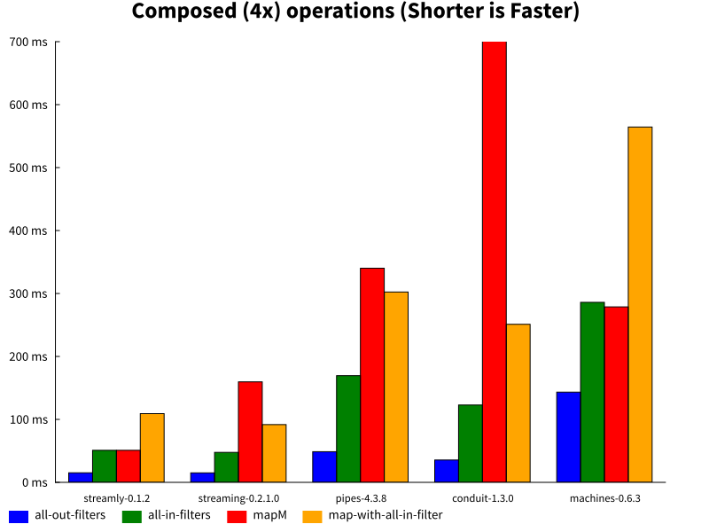
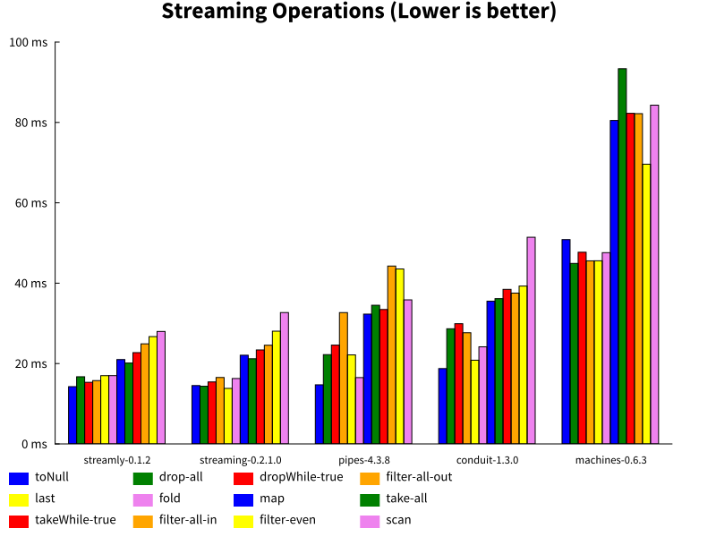

# Streamly

[](https://hackage.haskell.org/package/streamly)
[](https://gitter.im/composewell/streamly)
[](https://travis-ci.org/composewell/streamly)
[](https://ci.appveyor.com/project/harendra-kumar/streamly)
[](https://coveralls.io/github/composewell/streamly?branch=master)

## Stream`ing` `Concurrent`ly

Streamly, short for streaming concurrently, is a simple yet powerful streaming
library with concurrent merging and concurrent nested looping support. A stream
is just like a list except that it is a list of monadic actions rather than
pure values.  Streamly streams can be generated, consumed, combined, or
transformed serially or concurrently. We can loop over a stream serially or
concurrently.  We can also have serial or concurrent nesting of loops. For
those familiar with the list transformer concept streamly is a concurrent list
transformer. Streamly uses standard composition abstractions. Concurrent
composition is just the same as serial composition except that we use a simple
combinator to request a concurrent composition instead of serial. The
programmer does not have to be aware of threads, locking or synchronization to
write scalable concurrent programs.

Streamly provides functionality that is equivalent to streaming libraries
like [pipes](https://hackage.haskell.org/package/pipes) and
[conduit](https://hackage.haskell.org/package/conduit) but with a list like
API. The streaming API of streamly is close to the monadic streams API of the
[vector](https://hackage.haskell.org/package/vector) package and similar in
concept to the [streaming](https://hackage.haskell.org/package/streaming)
package. In addition to providing streaming functionality, streamly subsumes
the functionality of list transformer libraries like `pipes` or
[list-t](https://hackage.haskell.org/package/list-t) and also the logic
programming library [logict](https://hackage.haskell.org/package/logict). On
the concurrency side, it subsumes the functionality of the
[async](https://hackage.haskell.org/package/async) package. Because it supports
streaming with concurrency we can write FRP applications similar in concept to
[Yampa](https://hackage.haskell.org/package/Yampa) or
[reflex](https://hackage.haskell.org/package/reflex). To understand the
streaming library ecosystem and where streamly fits in you may want to read
[streaming libraries](https://github.com/composewell/streaming-benchmarks#streaming-libraries)
as well. Also see the [Comparison with Existing
Packages](https://hackage.haskell.org/package/streamly/docs/Streamly-Tutorial.html)
section in the streamly tutorial.

Why use streamly?

  * Simple list like streaming API, if you know how to use lists then you know
    how to use streamly.
  * Powerful yet simple and scalable concurrency. Concurrency is not intrusive,
    concurrent programs are written exactly the same way as non-concurrent
    ones. There is no other package that provides such high level, simple and
    flexible concurrency support.
  * It is a general programming framework providing you all the necessary tools
    to solve a wide range of programming problems, unifying the functionality
    provided by several disparate packages in a concise and simple API.
  * Best in class performance. See
    [streaming-benchmarks](https://github.com/composewell/streaming-benchmarks)
    for a comparison of popular streaming libraries on micro-benchmarks.

  For more information, see:

  * [Streamly.Tutorial](https://hackage.haskell.org/package/streamly/docs/Streamly-Tutorial.html) module in the haddock documentation for a detailed introduction
  * [examples](https://github.com/composewell/streamly/tree/master/examples) directory in the package for some simple practical examples

## Streaming Pipelines

Unlike `pipes` or `conduit` and like `vector` and `streaming` `streamly`
composes stream data instead of stream processors (functions).  A stream is
just like a list and is explicitly passed around to functions that process the
stream.  Therefore, no special operator is needed to join stages in a streaming
pipeline, just the standard forward (`$`) or reverse (`&`) function application
operator is enough.  Combinators are provided in `Streamly.Prelude` to
transform or fold streams.

This snippet reads numbers from stdin, prints the squares of even numbers and
exits if an even number more than 9 is entered.

```haskell
import Streamly
import qualified Streamly.Prelude as S
import Data.Function ((&))

main = runStream $
       S.repeatM getLine
     & fmap read
     & S.filter even
     & S.takeWhile (<= 9)
     & fmap (\x -> x * x)
     & S.mapM print
```

## Concurrent Stream Generation

Monadic construction and generation functions e.g. `consM`, `unfoldrM`,
`replicateM`, `repeatM`, `iterateM` and `fromFoldableM` etc. work concurrently
when used with appropriate stream type combinator.

The following code finishes in 3 seconds (6 seconds when serial):

```
> let p n = threadDelay (n * 1000000) >> return n
> S.toList $ aheadly $ p 3 |: p 2 |: p 1 |: S.nil
[3,2,1]

> S.toList $ parallely $ p 3 |: p 2 |: p 1 |: S.nil
[1,2,3]
```

The following finishes in 10 seconds (100 seconds when serial):

```
runStream $ asyncly $ S.replicateM 10 $ p 10
```

## Concurrent Streaming Pipelines

Use `|&` or `|$` to apply stream processing functions concurrently. In the
following example "hello" is printed every second, if you use `&` instead of
`|&` you will see that the delay doubles to 2 seconds instead because of serial
application.

```
main = runStream $
      S.repeatM (threadDelay 1000000 >> return "hello")
   |& S.mapM (\x -> threadDelay 1000000 >> putStrLn x)
```

## Mapping Concurrently

We can use `mapM` or `sequence` concurrently on a stream.

```
> let p n = threadDelay (n * 1000000) >> return n
> runStream $ aheadly $ S.mapM (\x -> p 1 >> print x) (serially $ repeatM (p 1))
```

## Serial and Concurrent Merging

Semigroup and Monoid instances can be used to fold streams serially or
concurrently. In the following example we are composing ten actions in the
stream each with a delay of 1 to 10 seconds, respectively. Since all the
actions are concurrent we see one output printed every second:

``` haskell
import Streamly
import qualified Streamly.Prelude as S
import Control.Concurrent (threadDelay)

main = S.toList $ parallely $ foldMap delay [1..10]
 where delay n = S.once $ threadDelay (n * 1000000) >> print n
```

Streams can be combined together in many ways. We are providing some examples
below, see the tutorial for more ways. We will use the following `delay`
function in the examples to demonstrate the concurrency aspects:

``` haskell
import Streamly
import qualified Streamly.Prelude as S
import Control.Concurrent

delay n = S.once $ do
    threadDelay (n * 1000000)
    tid <- myThreadId
    putStrLn (show tid ++ ": Delay " ++ show n)
```
### Serial

```haskell
main = runStream $ delay 3 <> delay 2 <> delay 1
```
```
ThreadId 36: Delay 3
ThreadId 36: Delay 2
ThreadId 36: Delay 1
```

### Parallel

```haskell
main = runStream . parallely $ delay 3 <> delay 2 <> delay 1
```
```
ThreadId 42: Delay 1
ThreadId 41: Delay 2
ThreadId 40: Delay 3
```

## Nested Loops (aka List Transformer)

The monad instance composes like a list monad.

``` haskell
import Streamly
import qualified Streamly.Prelude as S

loops = do
    x <- S.fromFoldable [1,2]
    y <- S.fromFoldable [3,4]
    S.once $ putStrLn $ show (x, y)

main = runStream loops
```
```
(1,3)
(1,4)
(2,3)
(2,4)
```

## Concurrent Nested Loops

To run the above code with demand-driven depth first concurrency i.e. each
iteration in the loops can run concurrently depending on the consumer rate:

``` haskell
main = runStream $ asyncly $ loops
```

To run it with demand driven breadth first concurrency:

``` haskell
main = runStream $ wAsyncly $ loops
```

To run it with strict concurrency irrespective of demand:

``` haskell
main = runStream $ parallely $ loops
```

To run it serially but interleaving the outer and inner loop iterations
(breadth first serial):

``` haskell
main = runStream $ wSerially $ loops
```

## Magical Concurrency

Streams can perform semigroup (<>) and monadic bind (>>=) operations
concurrently using combinators like `asyncly`, `parallelly`. For example,
to concurrently generate squares of a stream of numbers and then concurrently
sum the square roots of all combinations of two streams:

``` haskell
import Streamly
import qualified Streamly.Prelude as S

main = do
    s <- S.sum $ asyncly $ do
        -- Each square is performed concurrently, (<>) is concurrent
        x2 <- foldMap (\x -> return $ x * x) [1..100]
        y2 <- foldMap (\y -> return $ y * y) [1..100]
        -- Each addition is performed concurrently, monadic bind is concurrent
        return $ sqrt (x2 + y2)
    print s
```

Of course, the actions running in parallel could be arbitrary IO actions.  For
example, to concurrently list the contents of a directory tree recursively:

``` haskell
import Path.IO (listDir, getCurrentDir)
import Streamly
import qualified Streamly.Prelude as S

main = runStream $ asyncly $ getCurrentDir >>= readdir
   where readdir d = do
            (dirs, files) <- S.once $ listDir d
            S.once $ mapM_ putStrLn $ map show files
            -- read the subdirs concurrently, (<>) is concurrent
            foldMap readdir dirs
```

In the above examples we do not think in terms of threads, locking or
synchronization, rather we think in terms of what can run in parallel, the rest
is taken care of automatically. When using `asyncly` the programmer does
not have to worry about how many threads are to be created they are
automatically adjusted based on the demand of the consumer.

The concurrency facilities provided by streamly can be compared with
[OpenMP](https://en.wikipedia.org/wiki/OpenMP) and
[Cilk](https://en.wikipedia.org/wiki/Cilk) but with a more declarative
expression.

## Reactive Programming (FRP)

Streamly is a foundation for first class reactive programming as well by virtue
of integrating concurrency and streaming. See
[AcidRain.hs](https://github.com/composewell/streamly/tree/master/examples/AcidRain.hs)
for a console based FRP game example and
[CirclingSquare.hs](https://github.com/composewell/streamly/tree/master/examples/CirclingSquare.hs)
for an SDL based animation example.

## Performance

`Streamly` has best in class performance even though it generalizes streaming
to concurrent composition that does not mean it sacrifices non-concurrent
performance. See
[streaming-benchmarks](https://github.com/composewell/streaming-benchmarks) for
detailed performance comparison with regular streaming libraries and the
explanation of the benchmarks. The following graphs show a summary, the first
one measures how four pipeline stages in a series perform, the second one
measures the performance of individual stream operations; in both cases the
stream processes a million elements:




## Contributing

The code is available under BSD-3 license
[on github](https://github.com/composewell/streamly). Join the
[gitter chat](https://gitter.im/composewell/streamly) channel for discussions.
You can find some of the
[todo items on the github wiki](https://github.com/composewell/streamly/wiki/Things-To-Do).
Please ask on the gitter channel or [contact the maintainer directly](mailto:harendra.kumar@gmail.com)
for more details on each item. All contributions are welcome!

This library was originally inspired by the `transient` package authored by
Alberto G. Corona.
