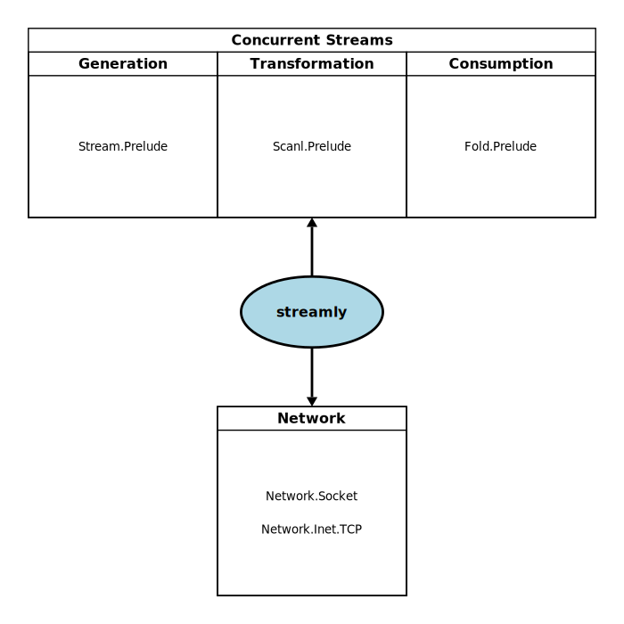

# Streamly: Types & Modules Cheat Sheet

This guide gives you a quick overview of Streamly’s core modules,
types, and their typical use cases. Use it as a reference map when
navigating the library.

## streamly-core package

## streamly package

## Streams

### Sources
- `Stream m a` — statically fused, composable source streams

  **Module:** `Streamly.Data.Stream`
- `Unfold m a b` — statically fused streams, for nested fusion

  **Module:** `Streamly.Data.Unfold`
- `StreamK m a` — CPS based source streams for dynamic composition

  **Module:** `Streamly.Data.StreamK`

### Transformations

- `Scanl m a b` — statically fused scans, for composable stateful transformation
  **Module:** `Streamly.Data.Scanl`

### Consumers

- `Fold m a b` — statically fused, composable stream consumers
  **Module:** `Streamly.Data.Fold`
- `Parser a m b` — statically fused, composable parsers
  **Module:** `Streamly.Data.Parser`
- `ParserK a m b` — CPS based parsers for dynamic composition
  **Module:** `Streamly.Data.ParserK`

---

## Arrays

Arrays are for storing data with efficient random access.

- `Array a => Unbox a` — immutable, unboxed (pinned/unpinned)
  **Module:** `Streamly.Data.Array`
- `MutArray a => Unbox a` — mutable, unboxed (pinned/unpinned)
  **Module:** `Streamly.Data.MutArray`
- `Array a` — unconstrained type
  **Module:** `Streamly.Data.Array.Generic`
- `MutArray a` — unconstrained type
  **Module:** `Streamly.Data.MutArray.Generic`
- `MutByteArray` — mutable byte arrays
  **Module:** `Streamly.Data.MutByteArray`
- `Unbox a` — fixed length binary serialization
  **Module:** `Streamly.Data.MutByteArray`
- `Serialize a` — variable length binary serialization
  **Module:** `Streamly.Data.MutByteArray`
- `RingArray a => Unbox a` — unboxed, circular buffer (pinned/unpinned)
  **Module:** `Streamly.Data.RingArray`

---

## Unicode Operations

- `Streamly.Unicode.Stream` — encode/decode streams of text
- `Streamly.Unicode.Parser` — parse Unicode chars/strings
- `Streamly.Unicode.String` — string interpolation utilities

---

## Concurrency

High-level concurrent, time-based, and lifted operations.

- `Streamly.Data.Stream.Prelude` — concurrent, composable stream sources
- `Streamly.Data.Scanl.Prelude` — concurrent, composable transformations
- `Streamly.Data.Fold.Prelude` — concurrent composable stream consumers
- `Streamly.Data.Stream.MkType` — define custom monad/applicative stream types  

---

## File System

- `Streamly.Console.Stdio` — console (stdin/stdout/stderr) streams
- `Streamly.FileSystem.Handle` — handle-based I/O streams
- `Streamly.FileSystem.FileIO` — path-based file I/O streams
- `Streamly.FileSystem.DirIO` — directory read operations
- `Streamly.FileSystem.Path` — file path operations

---

## Network

- `Streamly.Network.Socket` — socket-level stream operations
- `Streamly.Network.Inet.TCP` — TCP accept streams/connect
