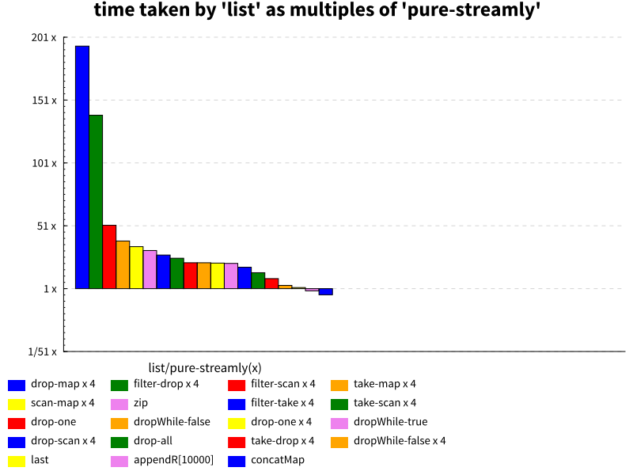

# Streams are concurrent monadic lists

Streamly streams are a generalization of Haskell lists with a similar API with
two crucial additions:

* A list is a _pure sequence_ of values whereas a stream is a _monadic
  sequence_ of values i.e. a sequence of values generated by monadic actions.
* The monadic actions producing the sequence can be executed concurrently.
  Concurrency is declarative and can be switched on or off using an appropriate
  combinator.

## Pure Streams vs Monadic Streams

A list is a sequence of pure values or pure steps that produce a value on
evaluation.  Ideally, we want to process each element in the sequence through a
pipeline of processing stages without first accumulating all the elements in
the sequence. This style of processing is known as "streaming" and it runs in
constant memory because we do not accumulate elements in memory, data gets
consumed as soon as it is produced.  If all the processing stages are pure,
lists can be used in a streaming style processing. For example, this is
streaming style processing:

```
  replicate 10 1
    & zipWith (+) [1..10]
    & map (+1)
    & filter odd
    & sum
```

However, if a list is generated in a strict monad (e.g. IO) it cannot be
consumed in a streaming fashion as described above. In that case the full list
first gets accumulated and then processed. This means we will consume memory
proportional to the size of the list and therefore it becomes unusable for
large lists. For example, the following code accumulates `xs` before it
processes it:

```
  xs <- replicateM 10 (return 1)
  zipWith (+) [1..10] xs
    & map (+1)
    & filter odd
    & sum
```

Monadic streams solve this problem. To be able to consume elements from
`replicateM` as it produces them we need a monadic representation of the stream
and stream processing operations that can consume the stream elements lazily
one at a time. Streamly provides a monadic representation for lists with the
same API.  So we can represent the previous example in a streaming fashion by
replacing the list combinators with corresponding streamly combinators:

```
  S.replicateM 10 (return 1)
    & S.zipWith (+) (S.fromList [1..10])
    & S.map (+1)
    & S.filter odd
    & S.sum
```

Streamly's monadic streams are a generalization of pure streams (aka lists) and
therefore can represent pure streams just as easily, making lists a special
case.

## Streamly as lists

`SerialT Identity a` can be used in place of `[a]` with equivalent or better
performance and almost identical interface except a few differences. Use of
`OverloadedLists` extension can make the difference even less significant. 


### Construction

Lists are constructed using `[]` and `:`.

```
> "hello" : "world" : []
["hello","world"]
```

Pure streams are constructed using `S.nil` (corresponds to `[]`) and `S.cons`
or `.:` (corresponds to `:`):

```
import Streamly
import Streamly.Prelude ((.:))
import qualified Streamly.Prelude as S

> "hello" .: "world" .: S.nil :: SerialT Identity String
fromList ["hello","world"]
```

### Pattern Matching

The crucial difference is that lists are built using constructors whereas
streams are built using functions. `S.nil` and `S.cons` are functions.
Therefore, you cannot directly pattern match on streams.  However, the yet
unexposed `Streamly.List` module also provides `Nil` and `Cons` pattern
synonyms corresponding to the list `[]` and `:` constructors for pattern
matches.

### Pure Operations

`SerialT Identity a` is an instance of `Show`, `Read`, `Eq`, `Ord`, `IsList`,
`Foldable` and `Traversable` type classes. Furthermore, `SerialT Identity Char`
is an instance of `IsString`. Use of `OverloadedLists` and `OverloadedStrings`
can make the use of streams in place of lists quite convenient.

Along with these we can use combinators from `Streamly.Prelude` to perform all
list operations on pure streams.

Lists:

```
> replicate 10 1
> map (+1) $ replicate 10 1
> length $ replicate 10 1
```

Pure streams are almost identical:

```
> S.replicate 10 1 :: SerialT Identity Int
> S.map (+1) $ S.replicate 10 1 :: SerialT Identity Int
> length (S.replicate 10 1 :: SerialT Identity Int)
```

## Monadic Operations

Lists have great performance as long as we perform only pure operations on
them. When monadic operations are performed on lists, they may accumulate
potentially unbounded or large lists in memory degrading performance massively.

Such "unsafe" list operations exist in `Control.Monad`, `Data.Traversable`, and
`Data.Foldable` in `base`. They are typically found with an `M` suffix.

Streamly provides monadic streams and the equivalents of the above mentioned
monadic list operations work on streams without any issues.

Unsafe monadic operations involving lists, run these example with `+RTS -s`
options:

```
import Control.Monad
main = do
  xs <- replicateM 10000000 (pure 1)
  ys <- mapM (\x -> return $ x + 1) xs
  print $ length ys
```

Streams:

```
import Streamly
import qualified Streamly.Prelude as S
main = do
  n <- S.length
      $ S.mapM (\x -> return $ x + 1)
      $ S.replicateM 10000000 (pure 1)
  print n
```

## Splitting Operations

Another unsafe category of operations for lists is stream splitting operations
e.g. `lines`, `splitAt` and `group`. Such operations may also accumulate
unbounded data in memory.

Stream splitting operations in streamly are streaming in nature and can work
without accumulating any data in memory.

### Monadic Lists

Monadic streams are nothing but lists made monadic. We can construct streams
using monadic actions, just the way pure lists are constructed:

```
> import Streamly.Prelude ((|:))
> import qualified Streamly.Prelude as S
> S.toList $ getLine |: getLine |: S.nil
hello
world
["hello","world"]
```

`|:` is the monadic construction equivalent of `:`.
The monadic action `getLine` is executed twice in a sequence, the first one
gets "hello" and second one gets "world" from the terminal and a stream
consisting of those strings is produced.

## Concurrent Monadic Lists

Streamly streams are not just monadic lists but they are concurrent monadic
lists. All the monadic streaming operations provided by streamly are inherently
concurrent.  Concurrent behavior can be enabled by just using an appropriate
modifying combinator, without any other change to the code.

The following code prints one element every second:

```haskell
import Control.Concurrent
import Streamly
import qualified Streamly.Prelude as S

func = S.mapM (\x -> threadDelay 1000000 >> print x) $ S.replicate 10 1
main = runStream func
```

To run it concurrently, just run the same code with `asyncly` combinator:

```haskell
main = runStream $ asyncly func
```

The `mapM` combinator now maps the monadic delay action concurrently on all the
stream elements.  It prints all the 10 elements after one second because all
the delay actions run concurrently. Alternatively we can write:

```
func = S.mapM $ asyncly $ S.replicateM (threadDelay 1000000 >> print 1)
main = runStream func
```

Here, the `replicateM` operation replicates the action concurrently.  In real
applications this could be a request to a web server that you may want to
perform multiple times concurrently.

## Performance: Streamly vs Lists

The following figures show the ratio of time and memory consumed by `[Int]`
(`base-4.12`) vs `SerialT Identity Int`
([streamly@00c7613](https://github.com/composewell/streamly)) for exactly the
same operation. `5x` on the y axis means lists take 5 times more resources
compared to streamly. Whereas a `1/5x` means that lists take 5 times less
resources compared to streamly. We only show those operations that are at least
10% better or worse in one library compared to the other. The operations are
shown in a sorted order, from list's worst performing ones on the left to its
best ones on the right.



## Why use streams instead of lists?

By using monadic streams instead of lists you get the following benefits:

* Use just one library for pure or monadic lists. There is no difference in
  pure or monadic code, its all the same.
* You can use a monadic action anywhere in the code e.g. printing a warning or
  error message or any other effectful operations. This is not possible in pure
  list code.
* You can make the code concurrent whenever you want without having to modify
  it.
* You do not have the risk of using unsafe/accumulating list operations
  degrading performance massively and resulting in space leaks.
* Streamly provides safe versions of partial list functions like `head`, `tail`
  etc.
* You get better fusion and therefore better performance for many operations,
  the only operation which is significantly faster for lists is `concatMap`.

## References

* [Data.List](https://hackage.haskell.org/package/base/docs/Data-List.html)
* [Control.Monad](http://hackage.haskell.org/package/base/docs/Control-Monad.html)
* [Data.Foldable](http://hackage.haskell.org/package/base/docs/Data-Foldable.html)
* [Data.Traversable](http://hackage.haskell.org/package/base/docs/Data-Traversable.html)
